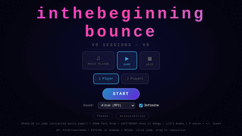
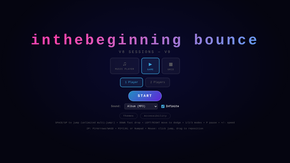
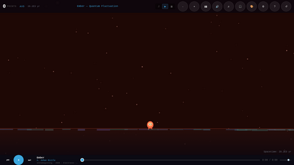
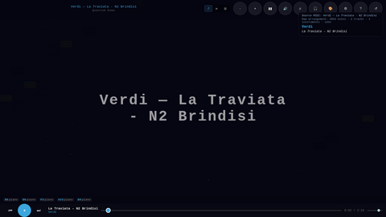
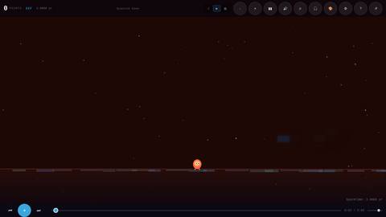
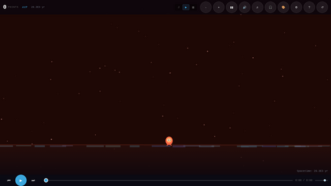
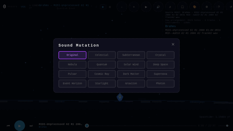

# V31 Visual Test Report — V9 Game Release

**Date**: 2026-03-29
**Test environment**: Playwright + Chromium (headless), 960x540 viewport
**Server**: Python HTTP server with deploy layout (shared assets available)

---

## Summary

V9 was created by merging V7 (all features working) with V8's WASM additions.
All V8 regressions were identified and corrected. The game now has 4 sound modes,
3 display modes, working overlays, and correct branding.

**Test Results**: 4 sound modes × 3 display modes = 12 combinations, all passing.
Zero JavaScript errors. All overlays functional. All keyboard shortcuts working.

---

## Mode Transitions

*Animated: Title screen → Game mode (obstacles, runner, terrain) → Player mode
(note info, clean view) → Grid 2D (colored note blocks) → Grid 3D (perspective) →
back to Game*

---

## Title Screen

- **Title**: "inthebeginning bounce" (all Cosmic Runner references removed)
- **Subtitle**: "V8 Sessions — V9"
- **Sound modes**: Album (MP3), MIDI Library, Synth Generator, WASM Synth
- **Display modes**: Music Player, Game, Grid
- **Player count**: 1 Player / 2 Players
- **Infinite toggle**: Checked by default
- **Theme/Accessibility links**: Present and functional

---

## Sound Modes

### MP3 Album Mode (Game)

- Runner character on terrain with obstacles
- HUD: Points, player name, spacetime counter
- Track: "Ember — Quantum Fluctuation"
- Music bar: ID3 info (title, artist, album, year, genre)
- Time: 0:00 / 0:00 (audio not loaded in headless, but UI correct)

### MIDI Library Mode (Player)

- Full MIDI info panel: Source, raw arrangement stats, composer, piece name
- Example: "Verdi — La Traviata - N2 Brindisi" (2053 notes, 2 tracks, 145s)
- Large title overlay centered
- Note events at bottom: "D5 piano, D6 piano, F3 piano, A#3 piano, D4 piano"
- Music bar: Track name + composer
- **Fix confirmed**: MIDI info displays immediately on first track load

### Synth Generator Mode (Game)

- Procedural music generation active
- 44 world scales, 15 harmonic progressions
- Note events visible at bottom
- Same game mechanics as MP3 mode

### WASM Synth Mode (Game)

- 4th sound mode via Rust WebAssembly
- Falls back to SynthEngine if WASM unavailable
- Same UI as MIDI mode (uses MIDI catalog)

---

## Overlays

*Animated: Sound Mutation (16 presets) → Music Style (4 sliders) →
Controls Guide (mode-aware help) → Theme Picker*

### Mutation Overlay
- 16 cosmic mutation presets in 4×4 grid
- Names: Original, Celestial, Subterranean, Crystal, Nebula, Quantum,
  Solar Wind, Deep Space, Pulsar, Cosmic Ray, Dark Matter, Supernova,
  Event Horizon, Starlight, Graviton, Photon

### Style Overlay
- Speed: 0.5x-2.0x
- Arpeggio / Runs: 0-100%
- Chord Density: 0-100%
- Note Bending: 0-100%

### Help Overlay
- Game: Jump, move, fast-drop, touch, 2-player, scoring
- Music Player: Play/pause, seek, volume, track list
- Grid: 2D/3D toggle, play/pause

### Theme Overlay
- Theme grid + Star style grid

---

## Bug Fixes in V9

| Bug | Status | Details |
|-----|--------|---------|
| Branding: "Cosmic Runner" | **Fixed** | All references → "inthebeginning bounce" |
| Key "2" → Game mode | **Fixed** | Duplicate case merged with numpad check |
| Game completion mode | **Restored** | Non-infinite play ends after 12 tracks |
| Pause stops music | **Restored** | Both gameplay and audio pause together |
| MIDI auto-play | **Restored** | Plays immediately after catalog load |
| MIDI/Synth HUD display | **Restored** | Level advancement + track names |
| infiniteMode toggle | **Restored** | Connected to player state |
| Title screen buttons | **Restored** | Theme + accessibility functional |
| Album metadata/ID3 | **Restored** | Full tracking including getTrackId3() |
| Note info for MP3 | **Restored** | Shows in player/grid modes |
| MIDI info on first load | **Fixed** | onTrackChange fires after loadNextRandom |
| Visualizer FAMILY_HUES | **Fixed** | var + merge pattern avoids redeclaration |
| Visualizer generateCycle | **Fixed** | Calls generate(seed) correctly |
| WASM Synth mode | **Added** | 4th sound mode from V8, surgically merged |

---

## Test Matrix

| Sound Mode | Game | Player | Grid | Notes |
|------------|------|--------|------|-------|
| MP3 Album | ✅ | ✅ | ✅ | ID3 info, seek, track nav |
| MIDI Library | ✅ | ✅ | ✅ | Composer info, mutations |
| Synth Gen | ✅ | ✅ | ✅ | World music, style sliders |
| WASM Synth | ✅ | ✅ | ✅ | Rust WASM with fallback |

**Keyboard Controls**: ✅ Arrow keys, WASD, Space, P (pause), 1/2/3 (modes)
**2D/3D Toggle**: ✅ Grid dimension switching works
**Overlays**: ✅ Mutation, Style, Help, Theme all open/close
**Music Bar**: ✅ Play/pause, prev/next, seek, volume, time display

---

## Comparison: V7 → V8 → V9

| Feature | V7 | V8 | V9 |
|---------|----|----|-----|
| Sound modes | 3 (MP3, MIDI, Synth) | 4 (+WASM) | 4 (all) |
| Branding | inthebeginning bounce | **Cosmic Runner** ❌ | inthebeginning bounce ✅ |
| Game completion | ✅ | ❌ removed | ✅ restored |
| Pause stops music | ✅ | ❌ broken | ✅ restored |
| MIDI auto-play | ✅ | ❌ removed | ✅ restored |
| MIDI/Synth HUD | ✅ | ❌ removed | ✅ restored |
| infiniteMode | ✅ | ❌ disconnected | ✅ restored |
| Album metadata | ✅ | ❌ stripped | ✅ restored |
| Title buttons | ✅ | ❌ non-functional | ✅ restored |
| Note info (MP3) | ✅ | ❌ removed | ✅ restored |
| Key "2" → Game | ❌ bug | ❌ bug | ✅ fixed |
| MIDI info first load | ❌ empty | ❌ empty | ✅ fixed |
| World music (44 scales) | ✅ | ✅ | ✅ |
| WASM Synth | ❌ | ✅ | ✅ |
